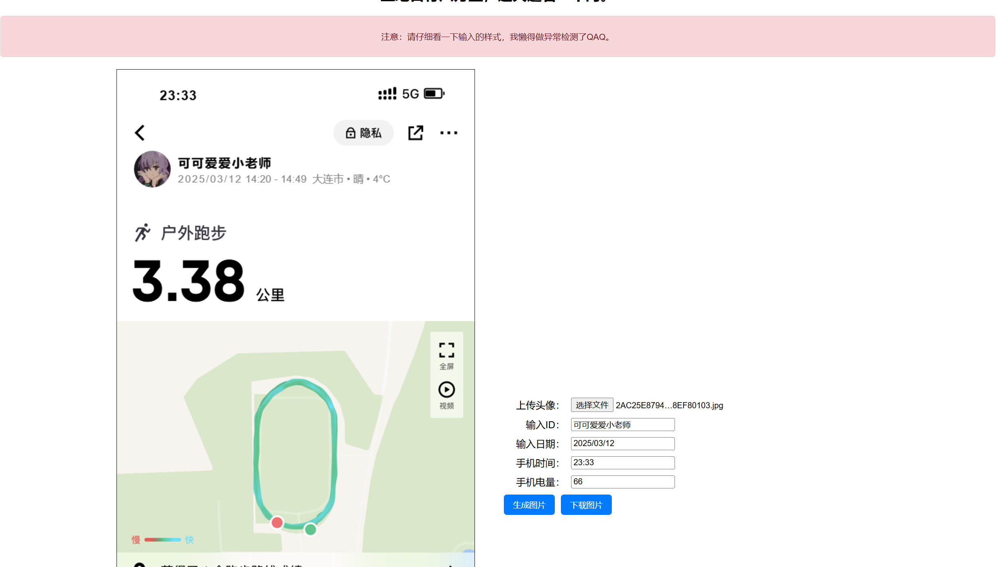

# SSDUT-KeepMoving

大黑山的妖风肆虐着这片土地，昏暗的灯光下，一排排的窝工战士在操场上匍匐前进着，他们手中的手机发出微弱的灯光，在操场上汇聚成一条流动的海洋。。。

“下周就要收keep截图了，今天也要打卡啊———”

**“好想，好想，好想坐地日行八万里，巡天遥看一千河啊————”**

大连理工大学软件学院keep截图工具。


 
## 目录

- [上手指南](#上手指南)
  - [开发前的配置要求](#开发前的配置要求)
  - [安装步骤](#安装步骤)
- [文件目录说明](#文件目录说明)
- [效果演示](#效果演示)
- [贡献者](#贡献者)
- [如何参与开源项目](#如何参与开源项目)
- [版本控制](#版本控制)
- [作者](#作者)


### 上手指南


###### 开发前的配置要求

1. 一个看起来不错的浏览器
2. 没了

###### **安装步骤**

```sh
git clone https://github.com/AcidBarium/SSDUT-KeepMoving.git
```

###### 项目细节介绍


### 文件目录说明

- fonts里面放着项目需要的字体，主要是keep的数字
- source是真实的跑道截图，项目的原理就是结合这些跑道和一些随机的正常数字得到截图。未来会不断扩充该文件夹以得到更加真实的效果。
- bg.png是keep的背景图
- faBuDaoSheQu.png是“发布到社区”一个图片
- icBatter.png 是手机电池。
- index.html 即简单网页html文件。
- style.css 即简单的网页css文件。
- script.js 也即简单的js文件。


### 效果演示



.png>)

### 贡献者


## 贡献者名单
<a href="https://github.com/AcidBarium/SSDUT-KeepMoving/graphs/contributors">
  
</a>

### 如何参与开源项目

贡献使开源社区成为一个学习、激励和创造的绝佳场所。你所作的任何贡献都是**非常感谢**的。


1. Fork the Project
2. Create your Feature Branch (`git checkout -b feature/AmazingFeature`)
3. Commit your Changes (`git commit -m 'Add some AmazingFeature'`)
4. Push to the Branch (`git push origin feature/AmazingFeature`)
5. Open a Pull Request


### 版本控制

该项目使用Git进行版本管理。您可以在repository参看当前可用版本。

### 作者
[Acidbarium](https://github.com/AcidBarium)

联系方式：acidbarium@gmail.com

### 版权说明

该项目签署了MIT 授权许可，详情请参阅[LICENSE](LICENSE)


